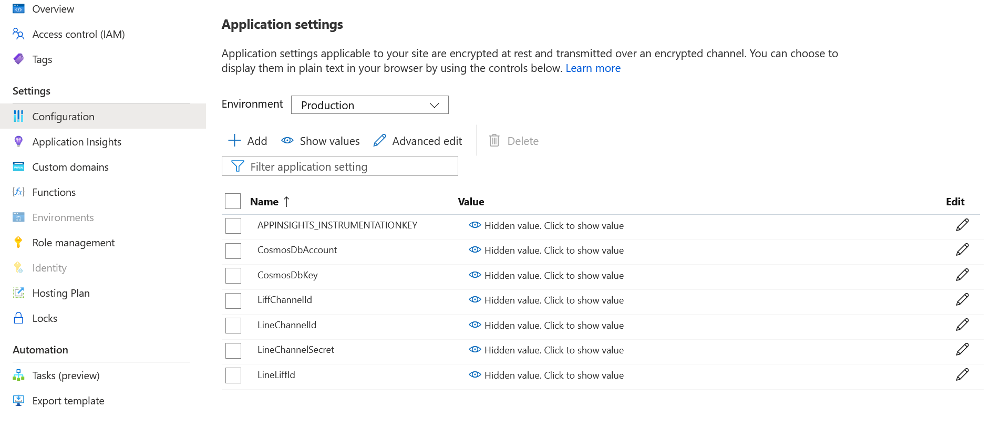
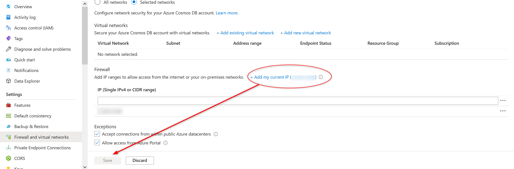
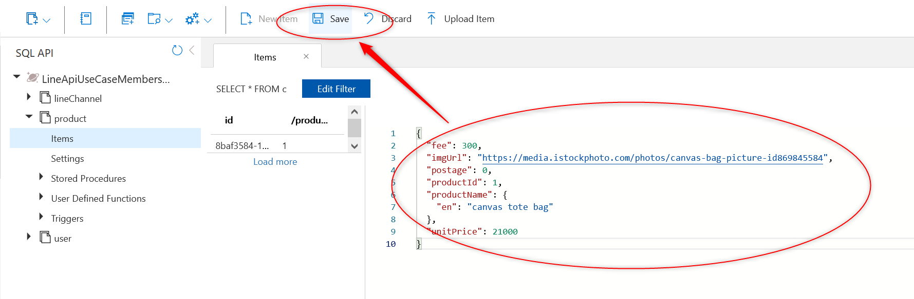

## Configure the backend deployed to Azure and submit the initial data
## Add environment variables
Open the "Configuration" of the deployed StaticWebApp from the portal and add the following values to the application settings

| key | val |
| --- | --- |
| LineChannelId | Channel ID of the Messaging API channel |
| LiffChannelId | Channel ID of the LINE login channel where LIFF is registered. |
| LineLiffId | ID of the LIFF registered with LINE Login |
| LineChannelSecret | channel secret for Messaging API channel |
| CosmosDbAccount | Cosmos DB account URL |
| CosmosDbKey | Cosmos DB key |



Click on the "Save" button to save the file.

## Firewall configuration for CosmosDB
Since the currently prepared Bicep has a connection IP address restriction for CosmosDB, you need to add the IP address of the work source in the firewall settings of the portal.

In the CosmosDB portal go to Settings > Firewall and Virtual Network and click on "Add my current IP" and save the settings.



## Register master data to CosmosDB
- Access the deployed Cosmos DB from the portal, open the data explorer and do the following
- Create DB
  - Create a Database with the Database id `LineApiUseCaseMembersCard `.
- Create a container
  - Create product, user, and lineChannel containers according to the following container information
  - For product, add [test data in resources/data](../resources/en/data) to product.
    Press the triangle to the left of "product" to expand it, select "Items", and press "New Item".
    
    Paste the JSON of the test data into the input screen and press "Save".
        
  - Add the following data to the lineChannel, and don't forget to enclose the channelId in "".
    - ```json
        {
          "channelId": "Channel ID of the Messaging API channel",
          "channelSecret": "The channel secret of the Messaging API channel",
          "channelAccessToken": "The channel access token of the Messaging API channel",
          "limitDate": "2021-01-01T00:00:00.0000000+00:00",
          "updatedTime": "2021-01-01T00:00:00.0000000+00:00"
        }
      ```
  - The user is created at registration, so no need to create it manually.

### container info

| Description | Container name | Pk |
| --- | --- | --- |
| product information | product | /productId |
| user information | user | /userId |
| line channel information | lineChannel | /channelId |


# Development Environment
## Libraries
### NET Core
NET Core 3.1 is used for this sample. NET Core 3.1. If you do not have it installed, download it from [link](https://dotnet.microsoft.com/download).  
You can check if it is already installed by typing the following command at a command prompt or terminal.
```sh
dotnet --version

3.1.xxx ← If you see something like this, it is installed.
```
### Azure Functions Core Tools
The backend is implemented with Azure Functions.  
To run Azure Functions locally, you need Azure Functions Core Tools.  
If you don't have it installed, please follow the [link](https://docs.microsoft.com/en-us/azure/azure-functions/functions-run-local?tabs=windows%2Ccsharp%2Cbash# install-the-azure-functions-core-tools) and follow the instructions.

## IDE
You can use whatever you like, but we recommend VSCode if you are not particular about it.
- Visual Studio Code
  - https://code.visualstudio.com
- Azure Functions for Visual Studio Code
  - https://marketplace.visualstudio.com/items?itemName=ms-azuretools.vscode-azurefunctions

# Run in the local development environment
## Advance preparation
### Prepare local.settings.json
backend > Add [local.settings.json](../resources/en/local.settings.json) directly under the MembersCard.  
Rewrite the following parameters sequentially.

- `LineChannelId` Channel ID of the Messaging API channel.
- `LiffChannelId` The channel ID of the LINE login channel where the LIFF is registered.
- `LineLiffId` ID of the LIFF registered for LINE login.
- `CosmosDbAccount` Cosmos DB account URL (if you use CosmosDB emulator locally, you can leave the template file as it is)
- `CosmosDbKey` Cosmos DB key (if you use CosmosDB emulator locally, you can leave the template file as it is)

### ngrok
We will use ngrok to display the local LIFF application.
- Install ngrok
  - https://ngrok.com/download

### Prepare CosmosDB.
#### Preparing an emulator
If you want to work locally, you will need to prepare an emulator.
- Windows
  - Download it from [link](https://docs.microsoft.com/en-us/azure/cosmos-db/local-emulator?tabs=ssl-netstd21#download-the-emulator).

- Linux,MacOS
  - Use Docker to launch the emulator. Follow the steps to prepare it from [link](https://docs.microsoft.com/en-us/azure/cosmos-db/linux-emulator).
#### Master Registration
Create the database, container and master data using the [same procedure](#Register master data to CosmosDB) as you did for the Azure resource.

## Run locally using ngrok
- [members_card.js](../../frontend/members_card.js) environment variable to the appropriate value
- Change environment variables in [frontend folder](./frontend/) directly under
  - Set up a local server such as `php -S localhost:5000`.
- Publish the URL of the public server using [ngrok](https://ngrok.com/).
    - `ngrok http 5000`.
      - Set the endpoint URL of the LIFF application to the URL issued by ngrok.
- After starting functions, go to the LIFF URL 

# API information

## members_card
POST http://localhost:7071/api/members_card
## request JSON

| name | description | required |
| --- | --- | --- |
| mode |init or buy | * |
| idToken | LINE authentication token| * |
|language|display language||

Sample

```json
{
    "idToken": "xxx",
    "mode": "buy",
    "language": "en"
}
```

### Response Sample

```json
{
    "userId": "Uxxxxxxxxxxxxxxxxxxxxxx",
    "barcodeNum": 434393483223,
    "pointExpirationDate": "2022/08/31",
    "point": "0"
}
````

[Go to next page](frontend-deployment.md)

[Back to Table of Contents](./README_en.md)
