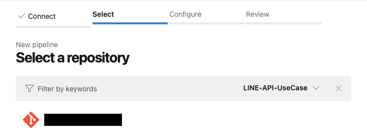
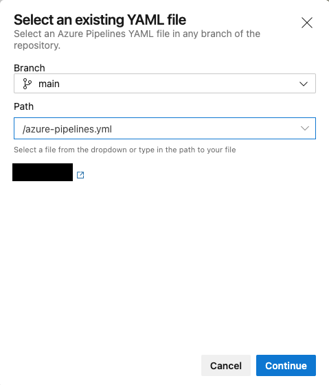
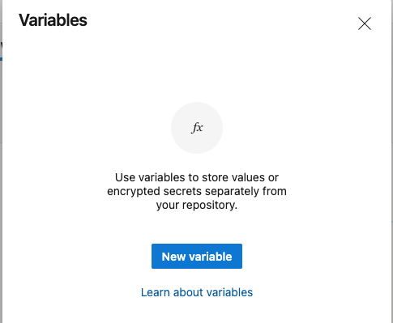
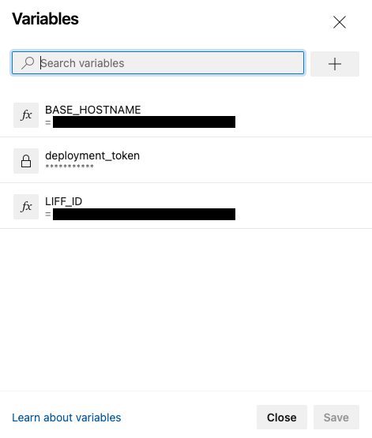

## Deploy using Azure DevOps.

## Prerequisites

- Azure account

- Azure DevOps account

- Bash environment in Azure CLI (confirmed to work with version 2.22.1)

  - Run with [Azure Cloud Shell](https://docs.microsoft.com/en-us/azure/cloud-shell/quickstart)

    If you use Azure Cloud Shell, the latest version is already installed.

    1. configure subscription

        To set up a subscription, use the following command:

        ```sh
        az account set --subscription <Subscription ID>
        ```

  - Run the Azure CLI with [local installation](https://docs.microsoft.com/en-us/cli/azure/install-azure-cli).

    1. Sign in to the Azure CLI using

       ```
       az login
       ```

    2. Configure subscriptions

       ```sh
       az account set --subscription <Subscription ID>
       ```

## Create Azure resource

1. Create an Azure resource.

   ```sh
   rg=<ResouceGroup Name>
    az group create -n $rg -l eastasia
    az deployment group create -g $rg --template-file main.bicep
   ```

2. Get a deployment token.

   ```sh
   staticAppId=$(az resource list -g $rg --query "[?type=='Microsoft.Web/staticSites'].id" -o tsv)
   az rest --method post --url "$staticAppId/listsecrets?api-version=2020-06-01" --query 'properties.apiKey' -o tsv
   ```

   Please save this value for use in subsequent steps.

3. get the hostname of Azure Static Web Apps.

   ```sh
   az resource show --ids $staticAppId --query properties.defaultHostname -o tsv
   ```

## Application Deployment

1. Go to Azure Pipelines.

1. select **[Create Pipeline]**.

    

1. select **[Azure Repos Git]**.

    

1. Select your Git repository.

   

1. select **[Existing Azure Pipelines YAML file]**.

    

1. Enter the following and select **[Continue]**.

    - Branch: `main`
    - Path: `/azure-pipelines.yml`

    

1. select **[Variables]**.

    

1. select **[New variable]**.

     

1. Enter the following and select **[OK]**.

   - Name: `deployment_token`
     - Value: Deployment token
     - Keep this value secret: ON

    

1. add it using the same procedure.

   - Name: `LIFF_ID`
     - Value: LIFF App ID
     - Keep this value secret: OFF
   - Name: `BASE_HOSTNAME`
     - Value: Host name of Azure Static Web Apps
     - Keep this value secret: OFF

1. select **[Save]**.

    

1. select **[Run]**.

    

1. Deployment was successful.

    

Next, configure the deployed backend and submit the initial data. Please proceed to [Building the backend](backend-deployment.md).

## Reference

- [Tutorial: Publish Azure Static Web Apps using Azure DevOps | Microsoft Docs](https://docs.microsoft.com/en-us/azure/static-web-apps/publish-devops)


[Go to next page](backend-deployment.md)

[Back to Table of Contents](./README_en.md)
