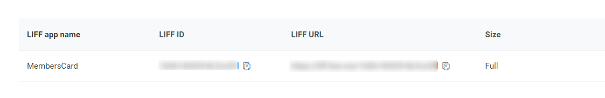

# Configure the frontend deployed to Azure

Deployment is executed in a pipeline, so there is no special work to do

# Development environment / Local development environment
## IDE
You can use whatever you like, but we recommend VSCode if you are not particular about it.

Visual Studio Code  
https://code.visualstudio.com

## PHP, http-server
This is used to set up a local server.  

http-server  
https://www.npmjs.com/package/http-server

## ngrok
Use ngrok to display local LIFF apps.
Install ngrok  
https://ngrok.com/download

## Run locally using ngrok.
  - [members_card.js](../../frontend/members_card.js) environment variable to the appropriate value.
    - Change `const BASE_URL` to the URL of Static Web Apps
    - Change the value of `const liffId` by obtaining the liffId from the official LINE account.
  - Change the value of `const BASE_URL` to `const BASE_URL`. /frontend/) and set up a local server.
    - Use `php -S localhost:5000` or `http-server -p 5000`.
  - Publish the URL of the public server using [ngrok](https://ngrok.com/).
      - `ngrok http 5000`.
        - Set the endpoint URL of the LIFF application to the URL issued by ngrok.
  - After starting functions, go to the LIFF URL 

[Go to next page](validation.md)

[Back to Table of Contents](./README_en.md)
