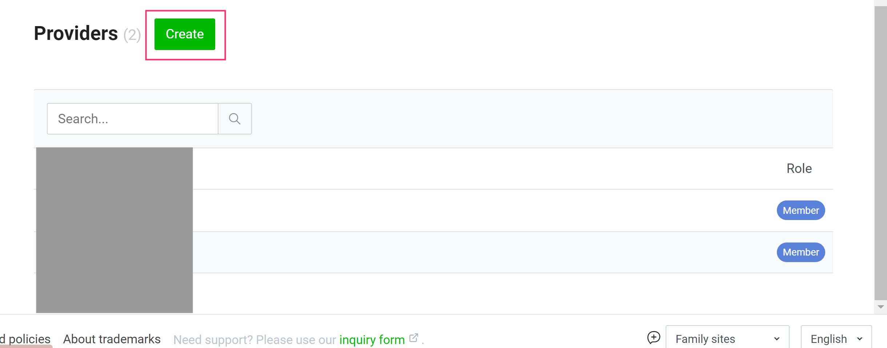
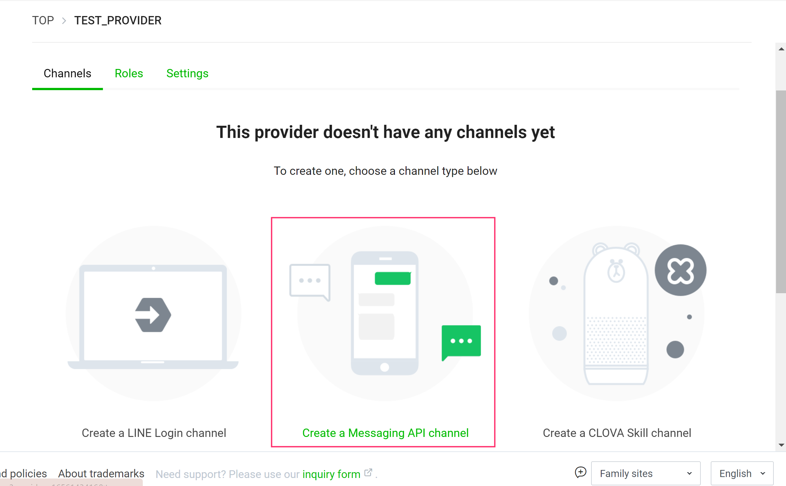
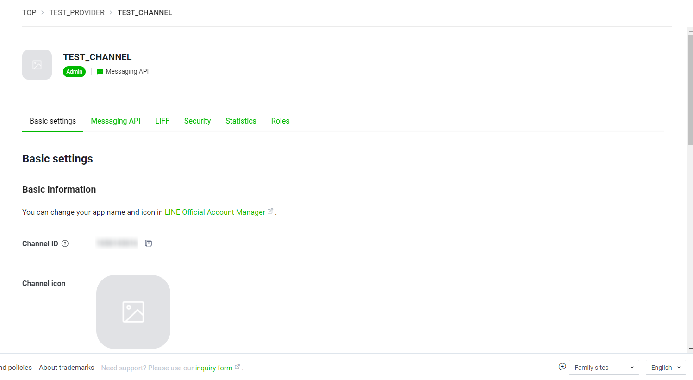
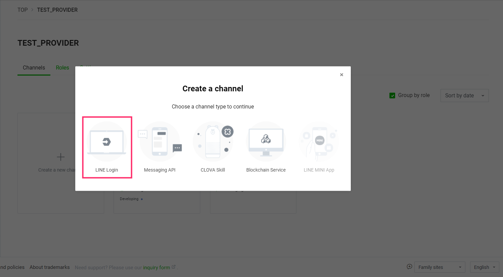
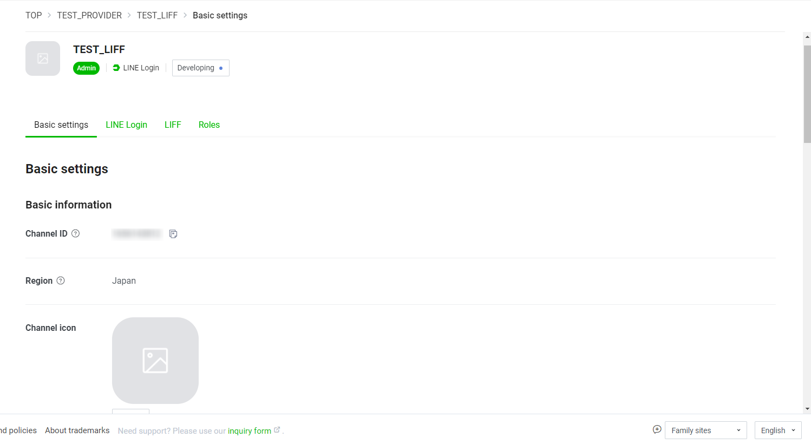
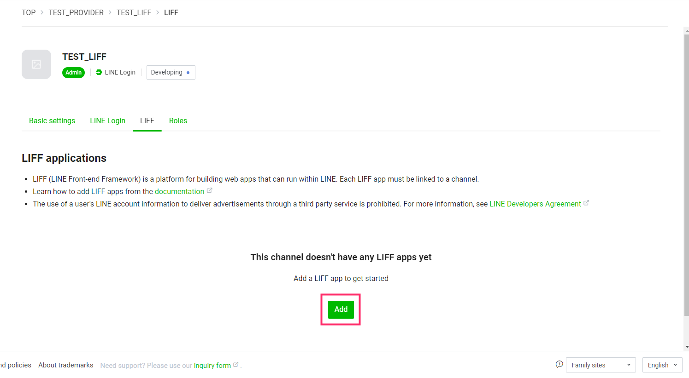
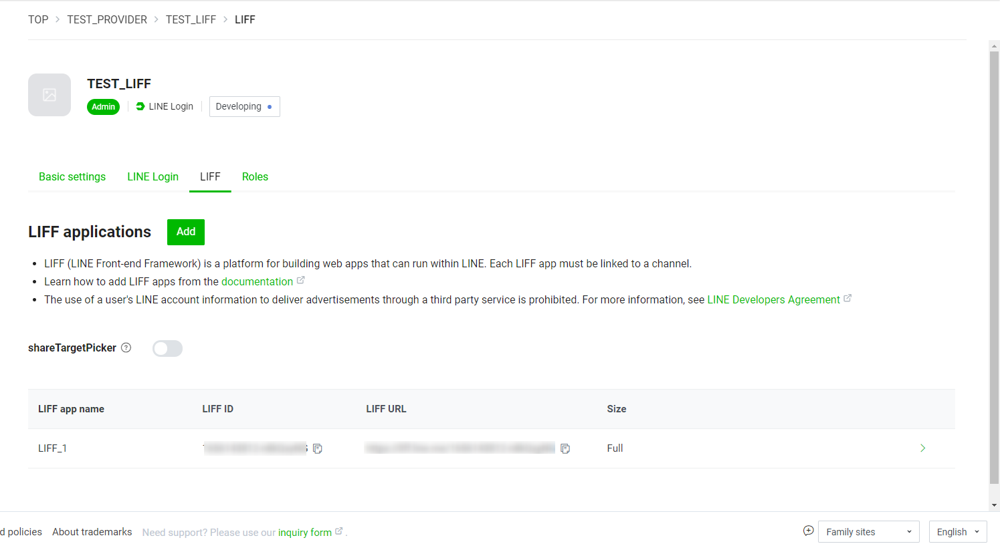
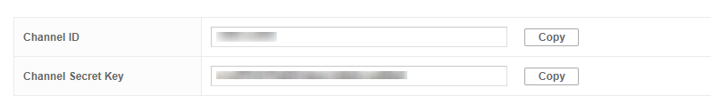

# Creating a LINE Channel

A channel is a communication channel between the system created by the developer and the LINE platform.
The following LINE channels are required for this application, so please follow the instructions to create them.

- LINE Channel for MessagingAPI  
- LINE channel for LIFF  
- LINEPay channel  

## 1. Create a LINE account

If you do not have a LINE account, please follow these steps.

  1. download the LINE App from the link below and create a LINE account.  
      https://line.me/en/

## 2. Login to LINE Developers

LINE Developers is a website for developers to create the official LINE account required for this application and to create LIFF applications.

1. access the following link and go to the login screen  
   https://developers.line.biz/en/
1. Login with your LINE account.
1. Enter your LINE account email address and password, or use QR Code Login to scan the QR Code from another device.

## 3. Create a Provider

A provider is a unit such as a team, company, or individual that manages multiple channels. There is a one-to-many relationship between a provider and a channel. 1.

1. while logged in to LINE Developes, go to the following console  
   https://developers.line.biz/console/
1. Click on the Create button next to the Provider heading.
   
1. Enter any provider name, and click Create.
   
1. Confirm that the provider has been created and you will see the following screen

## 4. Create the channel

1. Create a channel for Messaging API
   1. On the provider screen that you just created, click Messaging API.
      
   1. Set the following items as shown below.
      1. Channel Type: No change
      1. Provider: No change
      1. Channel Icon: No change
      1. Channel Name: Any channel name
         The channel name is the account name that will be displayed when the end user adds a friend. Can be changed later.
      1. Channel description: Any description
      1. Large industry: Industry that matches the content of the app
      1. Small Industry: Industry that matches the content of the application
      1. email address: No change
      1. Privacy Policy URL: optional
      1. Terms of Service URL: Optional
   1. Please read the LINE Official Account Terms of Service and LINE Official Account API Terms of Service, and check the "I agree" box.
   1. Click Create to create a channel
   1. The screen for the channel you have created will appear as shown in the image below, confirming that the channel has been created.
      

      The channel ID and channel secret shown in the Channel Basic Settings tab will be used in the following steps, so make a note of them.
1. create a channel for LIFF
    1. On the provider screen that you just created, click the LINE Login button.
                
    1. Set the following items as shown below.
        1. Channel Type: No change
           1. Provider: No change
           1. Region: Japan
           1. Channel Icon: No change
           1. hannel Name: Any channel name.
                 The channel name will be displayed when you log in to LINE. You can change it later.
           1. Channel Description: Any description.
           1. App Type: Check the Web App checkbox.
           1. email address: No change
           1. Policy URL: Optional
           1. Terms of Service URL: Optional
      1. Read the LINE Developer Agreement and check the box to agree to it
      1. Click Create to create a channel.
      1. The screen for the channel you have created will appear as shown in the image below, confirming that the channel has been created.
         

         Take note of the channel ID displayed in the Channel Basic Settings tab, as it will be used in the following steps.
  1. Setting up "Linked Bots"
      1. click the "Edit" button of the "Linked BOT" item in the "Channel Basic Settings" tab of the LIFF channel that you just created.
      1. select the MessagingAPI channel from the pull-down menu and update the settings.
  1. Adding a LIFF App
      1. In the LIFF channel that you created earlier, switch to the LIFF tab and click the Add button.
         
      1. Set the following items as shown below.
         1. LIFF app name: Any app name.
         1. size: Full
            This is the setting for the vertical size of the application to be displayed in LINE. See the link below. You can change it later.
            https://developers.line.biz/en/docs/liff/overview/#screen-size
         1. endpoint URL: https://example.com
            This is a temporary value that will be set again after the app is created.
         1. Scope: openid, check profile
         1. Botlink function: On (Aggressive)
            When the LIFF app is launched, it will prompt the user to add friends from the associated official LINE account. 1.
         1. Scan QR: off
         1. Module mode: off
      1. Press the "Add" button, and confirm that you have entered the screen shown in the image below.
         

         Make a note of the LIFF ID as it will be used in the following steps.
1. Create a channel for LINE Pay.  
   In this step, we will create a channel for demonstration purposes using Sandbox. In this step, we will create a channel for demo operation using Sandbox. Actual billing by LINEPay will not be performed. If you wish to use this as a production environment, please implement it separately.
   1. Go to [LINE Pay Developers](https://pay.line.me/tw/developers/techsupport/sandbox/creation?locale=en_US).
   1. Enter the following information in the Sandbox Generation section and click Submit.
      1. country: JP
      1. service type: Online
      1. currency: JPY
      Email Address: Enter a valid email address.
   1. Make sure you have received an email from LINE Pay at the email address you entered.
   1. go to [pay.line.me](https://pay.line.me/portal/global/main) and log in to the Merchant Center with the account information (test ID and password) provided in the email.
   1. After logging in, click the link [Payment Integration Management] -> [Manage Link Key] in the left menu.

   
   1. Enter the same password as when you logged in, and click "Confirm.
   1. Make a note of the Channel ID and Channel Secret Key displayed as shown in the image below, as they will be used later in the procedure.
      

## Reference
1. LINE Channel for MessagingAPI
  - Channel creation: https://developers.line.biz/en/docs/clova-extensions-kit/create-messaging-api-channel-t4/  
  - About Messaging API: https://lineapiusecase.com/en/api/msgapi.html  

2. line channel for LIFF  
  - Channel creation: https://developers.line.biz/en/docs/liff/registering-liff-apps/  
  - About LIFF: https://lineapiusecase.com/en/api/miniliff.html

3. channel for LINEPay  
  - Channel creation: https://pay.line.me/tw/developers/techsupport/sandbox/testflow?locale=en_US  
  - About LINEPay: https://lineapiusecase.com/en/api/pay.html  

[Go to next page](deployment.md)

[Back to Table of Contents](./README_en.md)
