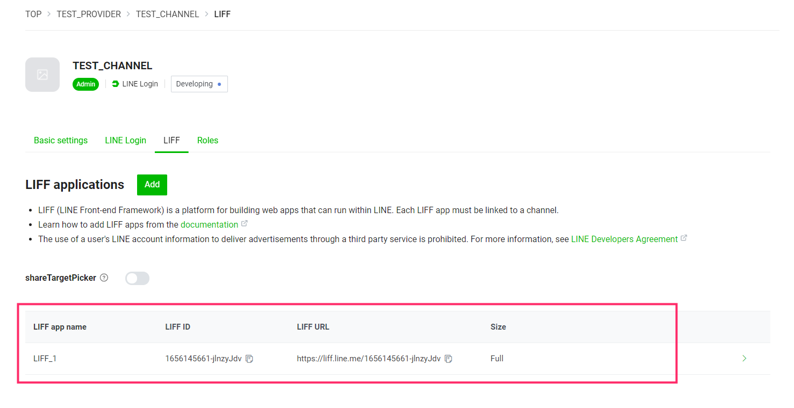
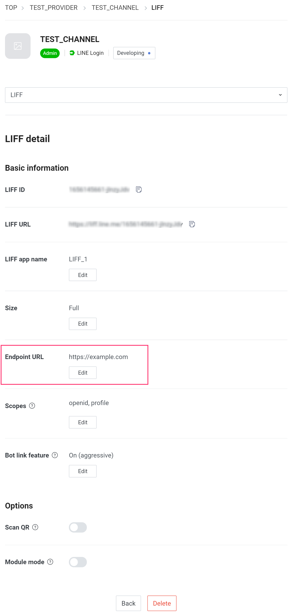
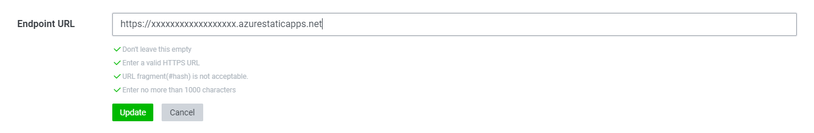

# Operation check
## Configure LIFF Endpoints
Set the endpoint URL for the LIFF App created in [Create LINE Channel -> Add LIFF App].

1. In the [LINE Developers Console](https://developers.line.biz/console/), go to the LIFF App page created in [Create LINE Channel -> Add LIFF App].

1. Click the Edit button in the Endpoint URL field.

1. Add https:// to the beginning of the host name of Azure Static Web Apps that you saved in the procedure of [Building and Deploying the Production (Azure) Environment], and enter it as follows, then click Update.

## Configure the rich menu
If you want to set up a rich menu to launch the application, please refer to the following link and set it up.  
https://developers.line.biz/en/docs/messaging-api/using-rich-menus/#creating-a-rich-menu-with-the-line-manager

## Operation check

After you have completed all the steps, please access the LIFF URL of the LIFF app that you created in [Create LINE Channel -> Add LIFF App] and check if it works.

[Back to Table of Contents](./README_en.md)
