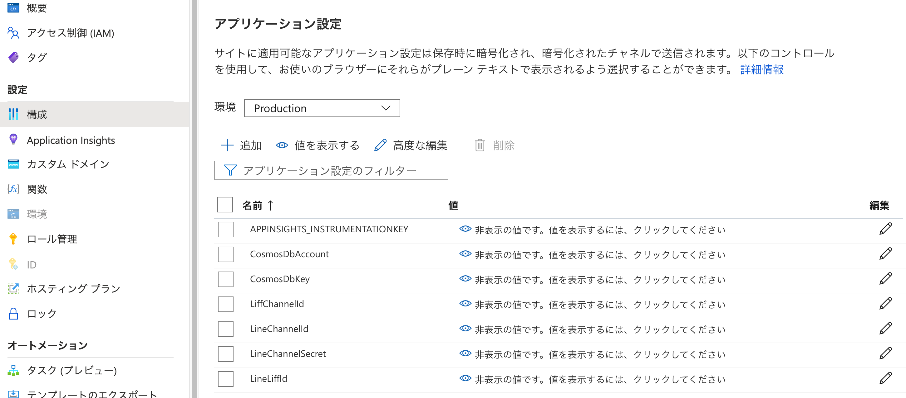
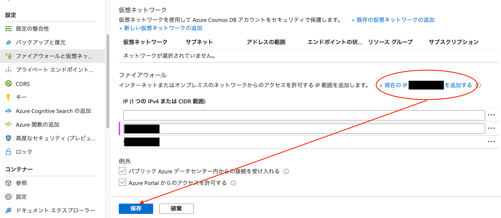
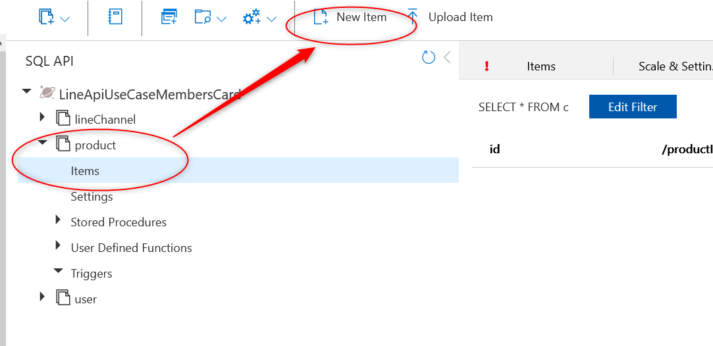
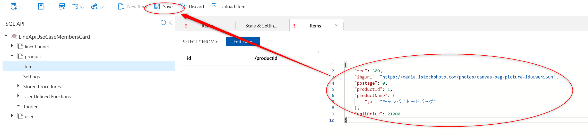

# Azureへデプロイしたバックエンドの設定と初期データの投入
## 環境変数の追加
デプロイしたStaticWebAppの「構成」をポータルから開き、アプリケーション設定に以下の値を追加します。

| key | val |
| --- | --- |
| LineChannelId | Messaging APIチャネルのチャネルID |
| LiffChannelId | LIFFを登録したLINEログインチャンネルのチャンネルID |
| LineLiffId | LINEログインに登録したLIFFのID |
| LineChannelSecret | Messaging APIチャネルのチャネルシークレット |
| CosmosDbAccount | Cosmos DBのアカウントURL |
| CosmosDbKey | Cosmos DBのキー |



「保存」ボタンを押して保存します。

## CosmosDBのファイアウォール設定
現在準備しているBicepではCosmosDBに接続IPアドレス制限がかかっているので、ポータルのファイアウォール設定で作業元のIPアドレスを追加する必要があります。

CosmosDBのポータルから 設定>ファイアウォールと仮想ネットワーク を開き「現在アクセスしているIPアドレスを追加する」を押下して保存をしてください。



## CosmosDBへマスタデータ登録
- デプロイしたCosmos DBにポータルからアクセスし、データエクスプローラーを開いて以下の作業を行ってください
- DB作成
  - Database id `LineApiUseCaseMembersCard ` でDatabaseを作成
- コンテナ作成
  - 下記のコンテナ情報の通りにproduct, user, lineChannelコンテナを作成
  - productには [resources/dataにあるテストデータ](../resources/jp/data) を追加
    productの左の三角を押して展開し、「Items」を選び、「New Item」を押す。
    
    入力画面にテストデータのJSONを貼り付け、「Save」を押す
        
  - lineChannelには 下記のようなデータを追加。channelIdは「””」で括るのを忘れない。
    - ```json
        {
          "channelId": "Messaging APIチャネルのチャネルID",
          "channelSecret": "Messaging APIチャネルのチャネルシークレット",
          "channelAccessToken": "Messaging APIチャネルのチャネルアクセストークン",
          "limitDate": "2021-01-01T00:00:00.0000000+00:00",
          "updatedTime": "2021-01-01T00:00:00.0000000+00:00"
        }
      ```
  - userは登録時に作成されるため、手動作成は不要

### コンテナ情報
| 説明 | コンテナ名 | pk |
| --- | --- | --- |
| 商品情報 | product | /productId |
| ユーザー情報 | user | /userId |
| LINEチャネル情報 | lineChannel | /channelId |


# 開発環境
## Libraries
### .NET Core
このサンプルは.NET Core 3.1を使用しています。インストール済みでない場合は、[リンク](https://dotnet.microsoft.com/download) からダウンロードしてください。  
コマンドプロンプト、又はターミナルにて以下のコマンドを入力し、インストール済みか確認できます。
```
dotnet --version

3.1.xxx ← このように表示されたら、インストール済みです。
```
### Azure Functions Core Tools
バックエンドはAzure Functionsで実装をしています。  
ローカルでAzure Functionsを実行するためにAzure Functions Core Toolsが必要です。  
インストール済みでない場合は、[リンク](https://docs.microsoft.com/ja-jp/azure/azure-functions/functions-run-local?tabs=windows%2Ccsharp%2Cbash#install-the-azure-functions-core-tools) から手順にそってダウンロードしてください。

## IDE
お好みのもので構いませんが、特にこだわりがなければVSCodeをお勧めします。
- Visual Studio Code
  - https://code.visualstudio.com
- Azure Functions for Visual Studio Code
  - https://marketplace.visualstudio.com/items?itemName=ms-azuretools.vscode-azurefunctions

# ローカル開発環境での実行
## 事前準備
### local.settings.jsonの用意
backend > MembersCard直下に[local.settings.json](../resources/jp/local.settings.json)を配置します。  
下記のバラメーターを順次書き換えてください。

- `LineChannelId` 	Messaging APIチャネルのチャネルID
- `LiffChannelId` LIFFを登録したLINEログインチャンネルのチャンネルID
- `LineLiffId`　LINEログインに登録したLIFFのID
- `CosmosDbAccount` Cosmos DBのアカウントURL(ローカルでCosmosDBエミュレータを使う場合はテンプレートファイルのままでOK)
- `CosmosDbKey` Cosmos DBのキー(ローカルでCosmosDBエミュレータを使う場合はテンプレートファイルのままでOK)

### ngrok
ローカルのLIFFアプリを表示するためにngrokを使用します。
- ngrokのインストール
  - https://ngrok.com/download

### CosmosDBの用意
#### エミュレーターの準備
ローカルで作業をする場合、エミュレーターを準備する必要があります。
- Windows
  - [リンク](https://docs.microsoft.com/ja-jp/azure/cosmos-db/local-emulator?tabs=ssl-netstd21#download-the-emulator) からダウンロードする。

- Linux,MacOS
  - Dockerを使用してエミュレーターを起動します。[リンク](https://docs.microsoft.com/ja-jp/azure/cosmos-db/linux-emulator) から手順に沿って準備してください。
  - MacOSの場合、下記も参考にしてください。
    - [Azure Cosmos DB Emulator がついに Linux 版に対応したので早速試してみた](https://zenn.dev/ymasaoka/articles/get-started-with-cosmosdb-linux-emulator)
#### マスター登録
Azureリソースに対して行ったものと[同様の手順](#CosmosDBへマスタデータ登録) でデータベース、コンテナ、マスタデータを作成してください

## ngrokを使ってローカル実行
- [members_card.js](../../frontend/members_card.js)の環境変数を適切な値に変更
- [frontendフォルダ](../../frontend/)直下に移動
  - `php -S localhost:5000`等ローカルサーバーを立てる
- [ngrok](https://ngrok.com/) を使って公開サーバーのURLを発行
    - `ngrok http 5000`
      - LIFFアプリのエンドポイントURLをngrokが発行したURLに設定
- functionsを起動後、LIFF URLに遷移する 

# API情報

## members_card
POST  http://localhost:7071/api/members_card
###  リクエストJSON

| 名前 | 説明 | 必須 |
| --- | --- | --- |
| mode |init or buy | 〇 |
| idToken | LINEの認証トークン|〇|
|language|表示言語||

サンプル

```json
{
    "idToken": "xxx",
    "mode": "buy",
    "language": "ja"
}
```

### レスポンスサンプル

```json
{
    "userId": "Uxxxxxxxxxxxxxxxxxxxxxx",
    "barcodeNum": 434393483223,
    "pointExpirationDate": "2022/08/31",
    "point": "0"
}
```

[次の頁へ](frontend-deployment.md)

[目次へ戻る](../../README.md)
