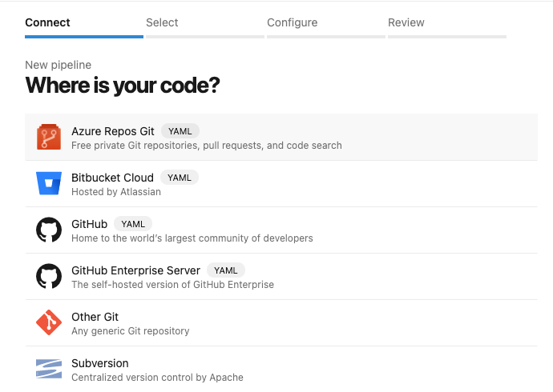
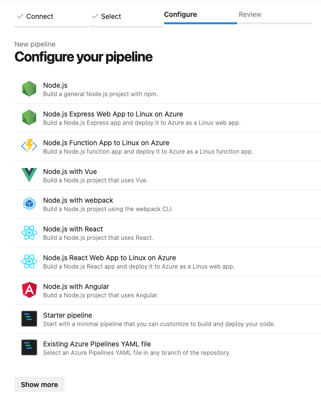
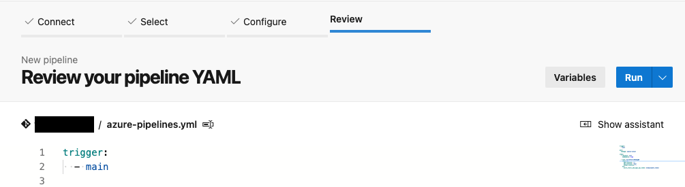
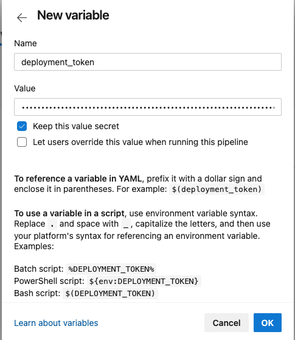
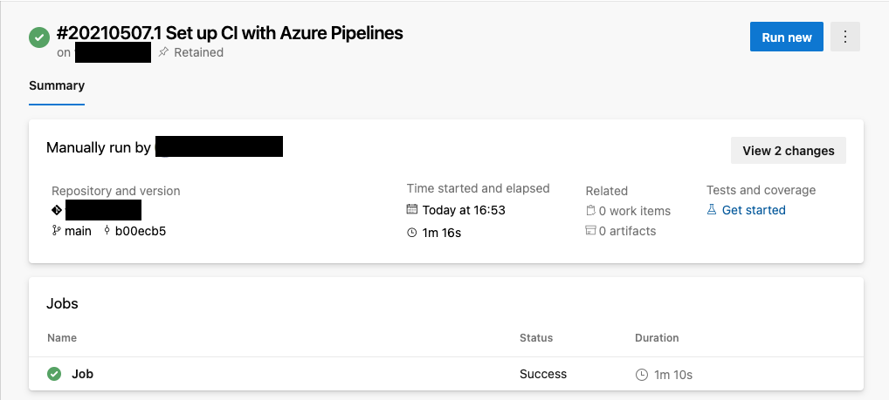

# Azure DevOpsを使用してデプロイする

## 前提条件

- Azureアカウント

- Azure DevOpsアカウント

- Azure CLI（バージョン2.22.1で動作確認）のBash環境

  - [Azure Cloud Shell](https://docs.microsoft.com/ja-jp/azure/cloud-shell/quickstart)で実行する

    Azure Cloud Shellを使用する場合は最新バージョンが既にインストールされています。

    1. サブスクリプションの設定

        ```sh
        az account set --subscription <Subscription ID>
        ```

  - Azure CLIを[ローカルインストール](https://docs.microsoft.com/ja-jp/cli/azure/install-azure-cli)して実行する

    1. Azure CLIにサインイン  

        ```sh
        az login
        ```

    1. サブスクリプションの設定

        ```sh
        az account set --subscription <Subscription ID>
        ```

## Azureリソース作成

1. Azureリソースを作成します。

    ```sh
    rg=<ResouceGroup Name>
    az group create -n $rg -l eastasia
    az deployment group create -g $rg --template-file main.bicep
    ```

1. デプロイトークンを取得します。

    ```sh
    staticAppId=$(az resource list -g $rg --query "[?type=='Microsoft.Web/staticSites'].id" -o tsv)
    az rest --method post --url "$staticAppId/listsecrets?api-version=2020-06-01" --query 'properties.apiKey' -o tsv
    ```

    以降の手順で利用するため、この値は保存しておいてください。

1. Azure Static Web Appsのホスト名を取得します。

    ```sh
    az resource show --ids $staticAppId --query properties.defaultHostname -o tsv
    ```

    以降の手順で利用するため、この値は保存しておいてください。

## アプリケーションデプロイ

1. Azure Pipelinesに移動します。

1. **[Create Pipeline]** を選択します。

    

1. **[Azure Repos Git]** を選択します。

    

1. Gitリポジトリを選択します。

   

1. **[Existing Azure Pipelines YAML file]** を選択します。

    

1. 下記を入力して、**[Continue]** を選択します。

    - Branch: `main`
    - Path: `/azure-pipelines.yml`

    

1. **[Variables]** を選択します。

    

1. **[New variable]** を選択します。

     

1. 下記を入力して、**[OK]** を選択します。

   - Name: `deployment_token`
     - Value: デプロイトークン
     - Keep this value secret: ON

    

1. 同様の手順で追加します。

   - Name: `LIFF_ID`
     - Value: LIFFアプリID
     - Keep this value secret: OFF
   - Name: `BASE_HOSTNAME`
     - Value: Azure Static Web Appsのホスト名
     - Keep this value secret: OFF

1. **[Save]** を選択します。

    

1. **[Run]** を選択します。

    

1. デプロイが成功しました。

    

続いてデプロイしたバックエンドの設定と初期データの投入を行います。[バックエンドの構築](backend-deployment.md)に進んでください。

## 参考

- [チュートリアル: Azure DevOps を使用して Azure Static Web Apps を発行する | Microsoft Docs](https://docs.microsoft.com/ja-jp/azure/static-web-apps/publish-devops)


[次の頁へ](backend-deployment.md)

[目次へ戻る](../../README.md)
