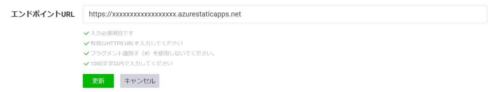

# 動作確認
## LIFFエンドポイントの設定
【LINEチャネルの作成 -> LIFFアプリの追加】にて作成したLIFFアプリのエンドポイントURLを設定します。  

1. [LINE Developersコンソール](https://developers.line.biz/console/)にて、【LINEチャネルの作成 -> LIFFアプリの追加】にて作成したLIFFアプリのページに遷移する。

1. エンドポイントURL項目の編集ボタンを押下する。

1. 【本番(Azure)環境構築/デプロイ】の手順にて保存しておいたAzure Static Web Appsのホスト名の先頭にhttps:// を付けて以下のように記載し、更新を押下する。

## リッチメニューの設定
リッチメニューを設定してアプリを起動する場合、以下リンクを参照し設定してください。  
https://developers.line.biz/ja/docs/messaging-api/using-rich-menus/#creating-a-rich-menu-with-the-line-manager

## 動作確認

すべての手順が完了後、【LINEチャネルの作成 -> LIFFアプリの追加】の手順にて作成したLIFFアプリのLIFF URLにアクセスし、動作を確認してください。

[目次へ戻る](../../README.md)
